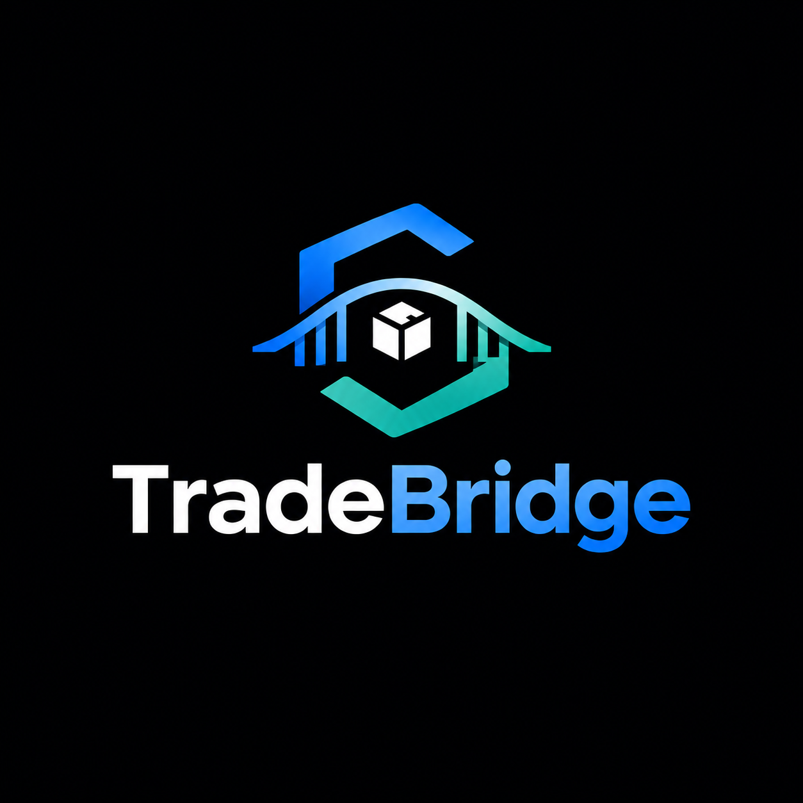

<p align="center">
  
</p>

# TradeBridge: Trustless B2B Escrow Protocol on Solana

> Built for the **Colosseum Crypto World's Fair Hackathon** (Solana track) and the **Superteam Nigeria side track**.

- **Demo video:** TODO
- **Live app:** [https://tradebridge-app.vercel.app](https://tradebridge-app.vercel.app)

TradeBridge is a non-custodial, escrow-backed cross-border settlement protocol built on Solana. It eliminates intermediary risk, high wire fees, and slow settlement in global physical trade by locking funds in Program Derived Address (PDA) vaults and releasing them deterministically upon verified shipment confirmation.

---

## Problem

Nigerian SME exporters selling to buyers abroad face a trust deadlock — the buyer won't pay before shipment, the seller won't ship before payment, and bank letters of credit are too slow, expensive, and inaccessible for small transactions. TradeBridge replaces the bank with program logic.

---

## Live on Devnet

- **Program ID:** [`3dmv4RrSanjP9Qdaj4E3D9ra9YNJrDg4QZP9sCmaK81v`](https://explorer.solana.com/address/3dmv4RrSanjP9Qdaj4E3D9ra9YNJrDg4QZP9sCmaK81v?cluster=devnet)
- **Test USDC Mint (6 decimals, devnet only):** `2Rehr4QfS9xpo6x8t9FptPneocaaYK5VyUiTaihnouzT`

### Verifiable On-Chain Transactions (Post-Hardening Run)

| Action | Transaction Signature |
| :--- | :--- |
| **Program redeploy** | [`SDkzPqDupwEAvhUXy4DzXQmgMfPjVNNku6GDvDSWs7mMKRCypEBpcBDfTyzp6H4CmkhRvig1yPEU4cbA99teJPq`](https://explorer.solana.com/tx/SDkzPqDupwEAvhUXy4DzXQmgMfPjVNNku6GDvDSWs7mMKRCypEBpcBDfTyzp6H4CmkhRvig1yPEU4cbA99teJPq?cluster=devnet) |
| **Create escrow ($250)** | [`4WRC4qzzLrgH8Hzc9z4KJdgrCxR33Phbi8AhsauToXNsNJcCqFgoQrRQq6jNaNvfFJpxtcx8CvNuEEMDBue4gw11`](https://explorer.solana.com/tx/4WRC4qzzLrgH8Hzc9z4KJdgrCxR33Phbi8AhsauToXNsNJcCqFgoQrRQq6jNaNvfFJpxtcx8CvNuEEMDBue4gw11?cluster=devnet) |
| **Confirm shipment** | [`4ZBXnrYPKtckWj8k1Uv65a2xW3YCi6kCj5cq7tpaDBE3VkYvRu93k9C9E67iMDRdH9WzR9skepkBxBVFgbUTMJmD`](https://explorer.solana.com/tx/4ZBXnrYPKtckWj8k1Uv65a2xW3YCi6kCj5cq7tpaDBE3VkYvRu93k9C9E67iMDRdH9WzR9skepkBxBVFgbUTMJmD?cluster=devnet) |
| **Release funds** (escrow + vault accounts closed, rent reclaimed) | [`3P4aeoAmybsEbEFTXcvrEoybJjqc1ZTg4L7vjvzvEwq2tvR1oFBBk4weDU4gxsaywezJJeYLUprSDMWQJQBQPLuw`](https://explorer.solana.com/tx/3P4aeoAmybsEbEFTXcvrEoybJjqc1ZTg4L7vjvzvEwq2tvR1oFBBk4weDU4gxsaywezJJeYLUprSDMWQJQBQPLuw?cluster=devnet) |
| **Resolve dispute (refund to buyer)** (escrow + vault accounts closed, rent reclaimed) | [`2fRZjNgJ9oejyxhEpUUvGV2nAXeWSDftCqtWxssUYLPAsvWjXknmFiZZssK3M2jQ65zmvdQRQmTzvxaaMxLf2g7G`](https://explorer.solana.com/tx/2fRZjNgJ9oejyxhEpUUvGV2nAXeWSDftCqtWxssUYLPAsvWjXknmFiZZssK3M2jQ65zmvdQRQmTzvxaaMxLf2g7G?cluster=devnet) |

> The full create ? confirm ? release flow was also verified manually through the web UI with two real Phantom wallets on devnet.

---

## Try It Yourself (Live Devnet App)

You can test the full bilateral escrow flow right now on Solana Devnet:

> [!NOTE]
> **Wallet Requirement:** Use Phantom or Solflare set to Solana Devnet. Other wallets may default to Mainnet and will not work with this demo.
> 
> **How to enable Devnet in Phantom:** Settings → Developer Settings → Testnet Mode → check Solana Devnet.

1. **Launch App:** Visit [https://tradebridge-app.vercel.app](https://tradebridge-app.vercel.app).
2. **Connect Wallet:** Connect Phantom (or Solflare) set to **Solana Devnet**. *(Note: Use Phantom or Solflare set to Solana Devnet. Other wallets may default to Mainnet and will not work with this demo. In Phantom: Settings → Developer Settings → Testnet Mode → check Solana Devnet).*
3. **Get Devnet Gas:** If your wallet is fresh, grab devnet SOL for transaction fees at [faucet.solana.com](https://faucet.solana.com).
4. **Get Test USDC:** Click **"Get 100 test USDC"** in the top banner. The app mints/transfers 100 devnet USDC directly to your wallet.
5. **Run the Bilateral Flow (Two Wallets):**
   - **Buyer:** Enter the Seller's address under Agreement Lookup. Under "Initialize a new trade escrow", deposit 50 USDC with a 7-day deadline and click **Create escrow**.
   - **Seller:** Connect the seller wallet (or search the Escrow PDA). Click **Confirm shipment** with an invoice reference / carrier tracking ID.
   - **Buyer:** Reconnect the buyer wallet. Inspect the verified shipment reference and click **Release funds**. The protocol executes token transfer to the seller and reclaims the escrow PDA rent back to the buyer.

---

## Architecture & Lifecycle

TradeBridge models the bilateral physical trade lifecycle as a deterministic on-chain finite state machine:

```
                            [ Buyer deposits funds ]
                                       |
                                       ?
                             +------------------+
                             |     Created      |
                             +------------------+
                                       |
                     +-----------------------------------+
    [ Deadline passed without shipment ]    [ Seller submits tracking ref ]
                     |                                   |
                     ?                                   ?
           +------------------+                +------------------+
           |     Refunded     |                | ShipmentConfirmed|
           +------------------+                +------------------+
                                                         |
                                        +---------------------------------+
                       [ Buyer confirms receipt ]               [ Buyer/Seller raises dispute ]
                                        |                                         |
                                        ?                                         ?
                              +------------------+                      +------------------+
                              |     Released     |                      |     Disputed     |
                              +------------------+                      +------------------+
                                                                                  |
                                                                    [ Arbiter resolves dispute ]
                                                                                  |
                                                                                  v
                                                                        +------------------+
                                                                        | Resolved (Closed)|
                                                                        +------------------+
```

---

## Key Design Decisions & Trade-Offs

### Shipment Verification: Manual Confirmation vs. Oracle / Attestation

TradeBridge's v1 shipment verification relies on the **seller submitting an on-chain tracking reference** and the **buyer manually confirming receipt** before releasing escrowed funds.

> **Intentional v1 Scope, Not an Oversight:**
> We deliberately chose this mechanism over two more complex alternatives — an oracle-fed shipment tracking feed or a neutral third-party (e.g., freight forwarder/customs partner) attestation — because manual confirmation is realistically buildable within a solo hackathon timeframe while still rigorously proving the core trust mechanism: **escrowed funds that cannot be unilaterally released or refunded once shipment is confirmed.**

#### Built-In Safeguards in v1:
- **Seller Protection:** Once shipment is confirmed, the buyer can no longer reclaim funds via timeout refund; funds can only be released to the seller or frozen via dispute.
- **Buyer Protection:** Funds cannot be released until the seller has confirmed shipment on-chain. If the seller defaults and never ships before the Unix deadline, the buyer can reclaim 100% of their deposit.
- **Freeze Mechanism (`raise_dispute`):** If goods are damaged, missing, or fraudulent, either party can invoke `raise_dispute` to permanently freeze fund movements on-chain and emit a `DisputeRaised` event for off-chain or arbitration resolution.

#### Production Upgrade Roadmap:
The existing `TradeEscrow` account layout is designed to support production upgrades **without breaking account structures or migrating PDAs**:
1. **Option A (Carrier Oracle Integration):** Connect an oracle crank (e.g., Switchboard or Chainlink Functions) that polls carrier APIs using the stored `tracking_ref` and automatically triggers `release_funds` upon verified carrier `"DELIVERED"` status.
2. **Option B (Neutral Logistics Attestation):** Require a cryptographic co-signature from an authorized logistics partner or inspection agent alongside the buyer's approval, removing single-party reliance entirely.

For the full architectural analysis and trade-off matrix, see [design/DESIGN_DECISIONS.md](design/DESIGN_DECISIONS.md).

---

## Known Limitations (v1)

- **No timeout release (not implemented):** Auto-release after a timeout is still not implemented. If the buyer never releases after shipment is confirmed, funds remain locked until manually released or disputed (planned: crank-based auto-release after N days if no dispute).
- **Dispute arbitration trust point:** v1 uses a single designated arbiter set at compile time (`resolve_dispute`), acting as a centralized trust point in the dispute path only (planned: per-escrow designated arbiter, multisig arbitration, or decentralized dispute resolution).
- **Single active agreement per pair:** One active escrow per buyer–seller pair (PDA seeds are `[escrow, buyer, seller]`).
- **Unverified tracking input:** Tracking reference is unverified free text (planned: carrier oracle or logistics attestation, see design decisions above).
- **Devnet scope:** Uses a devnet test USDC mint; unaudited; not for mainnet use.

---

## On-Chain Program (Anchor)

- **Program ID:** `3dmv4RrSanjP9Qdaj4E3D9ra9YNJrDg4QZP9sCmaK81v`
- **Network:** Solana Devnet
- **Framework:** Anchor (Rust)

### Core Instructions

| Instruction | Signer | State Required | Description |
| :--- | :--- | :--- | :--- |
| `create_trade_escrow` | Buyer | *None (Initializes)* | Transfers tokens from buyer into escrow PDA vault; sets deadline and amount. |
| `confirm_shipment` | Seller | `Created` | Stores courier tracking reference (up to 100 chars); advances status to `ShipmentConfirmed`. |
| `release_funds` | Buyer | `ShipmentConfirmed` | Releases vault tokens to seller token account using PDA signer seeds; reclaims rent. |
| `refund_if_expired` | Buyer | `Created` (Post-deadline) | Returns locked tokens to buyer if seller failed to ship before deadline; reclaims rent. |
| `raise_dispute` | Buyer or Seller | `ShipmentConfirmed` | Transitions status to `Disputed`, freezing all token transfers and emitting an event. |
| `resolve_dispute` | Arbiter | `Disputed` | Designated arbiter resolves dispute by releasing tokens to seller or refunding buyer; closes vault and escrow PDA, returning rent to buyer. |

---

## Project Structure

```
tradebridge/
+-- programs/
|   +-- tradebridge/
|       +-- src/
|           +-- lib.rs             # Anchor program source code
+-- tests/
|   +-- tradebridge.ts            # Integration test suite (13 tests)
+-- scripts/
|   +-- resolve-dispute.ts        # CLI tool for arbiter dispute resolution
+-- scripts/
|   +-- scenario-runner.ts        # 4 narrated B2B trade simulation scenarios
|   +-- devnet-demo.ts            # Live Devnet deployment & execution demo
+-- app/                          # Next.js 14 frontend web application
|   +-- src/app/                  # App Router pages and components
|   +-- public/                   # Static branding & assets
+-- design/
|   +-- DESIGN_DECISIONS.md       # ADR-001: Manual vs. Oracle / Attestation analysis
|   +-- LOGO_PROMPT.md            # Brand identity design prompt
+-- LICENSE                       # MIT License
```

---

## Getting Started

### Prerequisites
- **Rust:** 1.96.1
- **Solana CLI (Agave):** 2.1.0
- **Anchor CLI:** 0.31.1
- **Node.js:** 20+ and **Yarn:** 1.22+

> **Note on Ubuntu 22.04:**
> On Ubuntu 22.04 the prebuilt Anchor binaries fail with a GLIBC error, so build from source with:
> ```bash
> cargo install --git https://github.com/coral-xyz/anchor --tag v0.31.1 anchor-cli --locked --force
> ```

> **Known Build Issue:**
> The SBF toolchain uses Rust 1.79, so `Cargo.lock` pins these crates to pre-edition2024 versions: `blake3 1.5.5`, `zeroize 1.8.1`, `zeroize_derive 1.4.2`, `proc-macro-crate 3.2.0`, `indexmap 2.7.0`, `unicode-segmentation 1.12.0`. Do **NOT** run `cargo update`, and keep `Cargo.lock` committed.

### 1. Build and Run Tests
```bash
# Install root dependencies
yarn install

# Run the Anchor integration test suite
anchor test
```

> [!NOTE]
> Tests 9–13 exercise `resolve_dispute` and require the arbiter keypair (`~/tradebridge-arbiter.json`), so they are skipped gracefully on a fresh clone. The arbiter is a compile-time constant in `programs/tradebridge/src/lib.rs`, so a fork should replace it with its own key.

### 2. Run Narrated Trade Scenarios & Live Devnet Demo
```bash
# Runs 4 automated scenarios (Happy path, No-ship refund, Impersonation attack, Dispute freeze)
yarn scenario

# Runs live Devnet transaction verification demo
yarn devnet-demo
```

### 3. Launch Frontend Web Application
```bash
cd app
yarn install
yarn dev
```
Open [http://localhost:3000](http://localhost:3000) in your browser.

---

## License

This project is licensed under the MIT License - see the [LICENSE](LICENSE) file for details.
